# FlexFloorLib

FlexFloorLib 是一个强大的 Android 库，提供了类似京东首页布局的灵活楼层页面架构。它提供了模块化、动态可配置、高度解耦的 UI 解决方案。

## 特性

- **模块化架构**：每个楼层独立，支持热插拔
- **动态配置**：基于 JSON 的配置，支持远程更新
- **高性能**：多种优化策略，包括视图回收、缓存、懒加载和差异更新
- **吸顶支持**：内置楼层吸顶功能，支持平滑滚动
- **骨架屏加载**：专业的骨架屏效果，带有闪烁动画
- **MVVM 支持**：完全集成 Android Architecture Components
- **缓存管理**：智能内存和磁盘缓存，支持预加载功能
- **曝光追踪**：内置楼层曝光和点击事件追踪

## 架构图

```mermaid
graph TD
    A["FlexFloorLib 架构"] --> B["基础设施层"]
    A --> C["数据层"]
    A --> D["业务逻辑层"]
    A --> E["界面层"]
    
    B --> B1["IFloor<br/>楼层接口"]
    B --> B2["BaseFloor<br/>基础楼层"]
    B --> B3["FloorStyleUtils<br/>样式工具"]
    
    B1 --> B11["生命周期管理"]
    B1 --> B12["数据绑定"]
    B1 --> B13["事件监听"]
    
    B2 --> B21["通用实现"]
    B2 --> B22["模板方法"]
    
    B3 --> B31["渐变效果"]
    B3 --> B32["阴影处理"]
    
    C --> C1["FloorData<br/>数据模型"]
    C --> C2["FloorCacheManager<br/>缓存管理"]
    
    C1 --> C11["FloorType<br/>楼层类型"]
    C1 --> C12["FloorStyle<br/>样式配置"]
    C1 --> C13["FloorAction<br/>交互行为"]
    
    C2 --> C21["内存缓存"]
    C2 --> C22["磁盘缓存"]
    C2 --> C23["预加载机制"]
    
    D --> D1["FloorManager<br/>楼层管理器"]
    D --> D2["FloorViewPool<br/>视图池"]
    
    D1 --> D11["楼层注册"]
    D1 --> D12["楼层创建"]
    D1 --> D13["生命周期管理"]
    
    D2 --> D21["视图回收"]
    D2 --> D22["性能优化"]
    
    E --> E1["FloorAdapter<br/>适配器"]
    E --> E2["StickyFloorLayoutManager<br/>布局管理器"]
    E --> E3["FloorSkeletonView<br/>骨架屏"]
    
    E1 --> E11["数据绑定"]
    E1 --> E12["DiffUtil支持"]
    E1 --> E13["事件处理"]
    
    E2 --> E21["吸顶功能"]
    E2 --> E22["平滑滚动"]
    
    E3 --> E31["加载动画"]
    E3 --> E32["多种模板"]
    
    classDef layer fill:#e1f5fe
    classDef component fill:#f3e5f5
    classDef feature fill:#e8f5e8
    
    class A,B,C,D,E layer
    class B1,B2,B3,C1,C2,D1,D2,E1,E2,E3 component
    class B11,B12,B13,B21,B22,B31,B32,C11,C12,C13,C21,C22,C23,D11,D12,D13,D21,D22,E11,E12,E13,E21,E22,E31,E32 feature
```



FlexFloorLib 采用分层架构设计，从底层到顶层分为：基础设施层、数据层、业务逻辑层和界面层。每一层都有明确的职责分工，确保了代码的高内聚、低耦合。

## 核心组件

### 1. 数据模型 (`model/`)
- **FloorData**：核心楼层数据模型，包含类型、样式和动作配置
- **FloorType**：定义各种楼层类型的枚举（Banner、Grid、List、Card 等）
- **FloorStyle**：外观的综合样式配置
- **FloorAction**：交互行为配置

### 2. 基础类 (`base/`)
- **IFloor**：定义生命周期和功能的核心楼层接口
- **BaseFloor**：提供通用楼层实现的抽象基类
- **IFloorLifecycle**：生命周期管理接口
- **IFloorClickListener**：点击事件处理接口
- **IFloorExposureListener**：曝光追踪接口

### 3. 管理器 (`manager/`)
- **FloorManager**：楼层注册、创建和生命周期的单例管理器
- **FloorViewPool**：性能优化的视图回收池

### 4. 适配器 (`adapter/`)
- **FloorAdapter**：支持 DiffUtil 的高性能 RecyclerView 适配器
- **FloorDiffCallback**：用于平滑更新的高效差异计算

### 5. 缓存系统 (`cache/`)
- **FloorCacheManager**：具有内存和磁盘存储的智能缓存
- 支持预加载、过期和批量操作

### 6. UI 组件 (`widget/`)
- **StickyFloorLayoutManager**：支持楼层吸顶的自定义 LayoutManager
- **FloorSkeletonView**：具有多种模板的专业骨架屏加载
- **FloorSkeletonBuilder**：创建自定义骨架屏的构建器模式

### 7. 工具类 (`utils/`)
- **FloorStyleUtils**：支持渐变和阴影的综合样式工具

## 快速开始

### 1. 添加依赖

在您的应用 `build.gradle` 中添加：

```kotlin
dependencies {
    implementation project(':flexfloorlib')
}
```

### 2. 注册楼层类型

```kotlin
class MyApplication : Application() {
    override fun onCreate() {
        super.onCreate()
        
        // 注册楼层类型
        val floorManager = FloorManager.getInstance()
        floorManager.registerFloor(FloorType.TEXT) { TextFloor() }
        floorManager.registerFloor(FloorType.BANNER) { BannerFloor() }
        floorManager.registerFloor(FloorType.GRID) { GridFloor() }
    }
}
```

### 3. 实现自定义楼层

```kotlin
class TextFloor : BaseFloor() {
    
    override fun getFloorType(): String = FloorType.TEXT.typeName
    
    override fun onCreateView(parent: ViewGroup): View {
        return TextView(parent.context).apply {
            layoutParams = ViewGroup.LayoutParams(
                ViewGroup.LayoutParams.MATCH_PARENT,
                ViewGroup.LayoutParams.WRAP_CONTENT
            )
            setPadding(16, 16, 16, 16)
        }
    }
    
    override fun onBindData(holder: RecyclerView.ViewHolder, floorData: FloorData, position: Int) {
        val textView = holder.itemView as TextView
        val textData = floorData.data as? TextFloorData
        textView.text = textData?.content ?: floorData.title
    }
}
```

### 4. 设置 RecyclerView

```kotlin
class MainActivity : AppCompatActivity() {
    
    private lateinit var floorAdapter: FloorAdapter
    private lateinit var layoutManager: StickyFloorLayoutManager
    
    override fun onCreate(savedInstanceState: Bundle?) {
        super.onCreate(savedInstanceState)
        
        // 设置 RecyclerView
        layoutManager = StickyFloorLayoutManager(this)
        floorAdapter = FloorAdapter()
        
        recyclerView.apply {
            adapter = floorAdapter
            layoutManager = this@MainActivity.layoutManager
        }
        
        // 设置监听器
        floorAdapter.setFloorClickListener(object : IFloorClickListener {
            override fun onFloorClick(floorData: FloorData, view: View, position: Int) {
                // 处理楼层点击
            }
        })
        
        floorAdapter.setFloorExposureListener(object : IFloorExposureListener {
            override fun onFloorExposure(floorData: FloorData, position: Int, exposureRatio: Float) {
                // 处理楼层曝光
            }
        })
        
        // 加载楼层数据
        loadFloorData()
    }
    
    private fun loadFloorData() {
        val floorList = listOf(
            FloorData(
                floorId = "text_1",
                floorType = FloorType.TEXT,
                title = "Welcome",
                data = TextFloorData("Hello FlexFloor!"),
                style = FloorStyle(backgroundColor = "#FFFFFF"),
                action = null
            )
        )
        
        floorAdapter.updateFloors(floorList)
    }
}
```

## 高级功能

### 1. 缓存和预加载

```kotlin
val cacheManager = FloorCacheManager.getInstance(context)

// 缓存楼层数据
cacheManager.cacheFloorData("home_floors", floorList)

// 异步预加载数据
cacheManager.preloadFloorData("home_floors") {
    apiService.getFloorData()
}

// 获取缓存数据
val cachedFloors = cacheManager.getCachedFloorData("home_floors")
```

### 2. 骨架屏加载

```kotlin
// 为文本楼层创建骨架屏
val textSkeleton = FloorSkeletonBuilder.createTextFloorSkeleton(context)

// 创建自定义骨架屏
val customSkeleton = FloorSkeletonBuilder.create(context)
    .addRectangle(width = MATCH_PARENT, height = 120, cornerRadius = 8f)
    .addTextLine(width = 200, marginTop = 16)
    .build()

// 显示/隐藏骨架屏
textSkeleton.showSkeleton()
textSkeleton.hideSkeleton()
```

### 3. 吸顶楼层

```kotlin
val floorData = FloorData(
    floorId = "sticky_header",
    floorType = FloorType.TEXT,
    title = "Sticky Header",
    data = null,
    style = FloorStyle(),
    action = null,
    isSticky = true // 启用吸顶行为
)
```

### 4. 自定义样式

```kotlin
val style = FloorStyle(
    backgroundColor = "#FFFFFF",
    cornerRadius = 12f,
    marginTop = 16,
    marginBottom = 16,
    paddingLeft = 16,
    paddingRight = 16,
    elevation = 4f
)

// 编程方式应用样式
FloorStyleUtils.applyStyle(view, style)

// 创建自定义背景
val gradientDrawable = FloorStyleUtils.createGradientDrawable("#FF6B6B", "#4ECDC4")
val solidDrawable = FloorStyleUtils.createSolidDrawable("#FFFFFF", 8f)
```

## 性能优化

### 1. 视图回收
- 通过 RecyclerView 自动回收 ViewHolder
- 为不同楼层类型提供自定义视图池
- 高效内存管理

### 2. 数据缓存
- 双级缓存（内存 + 磁盘）
- 智能缓存过期机制
- 后台预加载

### 3. 懒加载
- 按需楼层创建
- 延迟数据加载
- 支持渐进式图片加载

### 4. 差异更新
- 集成 DiffUtil 实现平滑动画
- 部分载荷更新
- 最小化布局重计算

## 测试

该库包含全面的测试覆盖：

```kotlin
// FloorManager 测试示例
@Test
fun testFloorRegistration() {
    val floorManager = FloorManager.getInstance()
    floorManager.registerFloor("test") { TestFloor() }
    
    assertTrue(floorManager.isFloorRegistered("test"))
    
    val floor = floorManager.createFloor("test")
    assertNotNull(floor)
    assertEquals("test", floor?.getFloorType())
}
```

## 架构优势

### 1. 模块化
- 每个楼层都是自包含的
- 易于添加/移除楼层类型
- 独立开发和测试

### 2. 可扩展性
- 支持无限楼层类型
- 高效资源管理
- 支持水平扩展

### 3. 可维护性
- 清晰的关注点分离
- 定义良好的接口
- 全面的文档

### 4. 性能
- 针对大型数据集优化
- 最小内存占用
- 流畅的滚动体验

## 最佳实践

### 1. 楼层实现
- 保持楼层逻辑简单专注
- 为楼层特定数据使用数据类
- 实现适当的生命周期管理

### 2. 性能
- 尽可能使用视图回收
- 对重内容实现懒加载
- 监控内存使用并相应优化

### 3. 用户体验
- 提供骨架屏加载以提升感知性能
- 实现平滑的过渡和动画
- 优雅地处理错误状态

### 4. 架构
- 遵循 MVVM 模式
- 使用依赖注入
- 实施适当的错误处理

## 贡献

欢迎贡献！请阅读贡献指南并为任何改进提交 pull requests。

## 许可证

```
Copyright 2024 FlexFloor

Licensed under the Apache License, Version 2.0 (the "License");
you may not use this file except in compliance with the License.
You may obtain a copy of the License at

   http://www.apache.org/licenses/LICENSE-2.0

Unless required by applicable law or agreed to in writing, software
distributed under the License is distributed on an "AS IS" BASIS,
WITHOUT WARRANTIES OR CONDITIONS OF ANY KIND, either express or implied.
See the License for the specific language governing permissions and
limitations under the License.
``` 